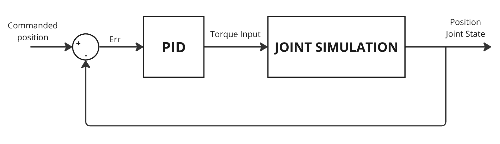

# cc8_Simulation
This repository contains the package with the robot description of CC8 Rover (Version: 2022-2023).

## URDF Structure
The robot is described using a URDF file (/urdf/cc8.xacro) written in a macro language called xacro in which all links and joints are defined with their parent-child relationships.
### CC8 Model

### CC8 Link Tree Rviz 

### Link Tree (Structure's links + Camera's links) Description

In the hierarchy of links within the model, the initial link must be defined without inertial properties and is referred to as `base_footprint`. The URDF format currently does not support defining a closed kinematic loop within this tree structure. Therefore, the mechanical function of the differential bar is only represented in Gazebo through a plugin **(`libleo_gazebo_differential_plugin.so`)**.

> **NOTE**: When using this URDF model outside of Gazebo simulations, an alternative system must be implemented to replicate the function of the differential bar, ensuring the coordinated rotation of **`rocker_joint_L`** and **`rocker_joint_R`**. Without this mechanism, **`base_link`** is free to rotate when exposed to gravitational forces.

#### `/urdf` Directory:
- **cc8.xacro**: URDF file written in a macro language called Xacro in which all links and joints are defined with their parent-child relationships.
- **cc8.gazebo**: Included in `cc8.xacro`. It defines the Gazebo plugins used and properties for the links. Gazebo plugins used:
  - **gazebo_ros_control**: This plugin allows defining and loading all controllers used in the Gazebo simulation. It is important to define the robot's namespace, as this is required during the controller loading phase [(Gazebo guide for `ros_control`)](https://classic.gazebosim.org/tutorials?tut=ros_control).
  - **rocker_differential**: A plugin specific to the Leo Rover model.
- **cc8.trans**:Included in `cc8.xacro`. This file defines all the transmission characteristics of the joints and their actuators. When defining a transmission, ensure the `hardwareInterface` matches the type of controller chosen for that joint to maintain consistency.
- **zed2.xacro**: Included in `cc8.xacro`. This file contains two macros. **`zed2`** describes the model of the Zed2i stereo camera, defining the links and joints used to position the optical reference frames of the two cameras. **`zed2_gazebo`** allows the simulation of the stereo camera within Gazebo by defining the necessary sensors and plugins along with all associated parameters. This setup enables the availability of key outputs during a Gazebo simulation, such as RGB images from both cameras, depth data, point clouds, internal IMU data, etc. (These data are published on the same topics typically used by the real Zed camera).
`zed2.xacro` was copied from the `leo_description` package of Leo Rover.

#### `/meshes` Directory:
This directory contains all the meshes for the individual links and the stereo camera. These meshes are referenced in `cc8.xacro`, which provides the overall description of the rover. The formats used are `.stl` and `.dae`, with the latter being particularly useful for importing textures of individual components (e.g., wheel colors, etc.). These meshes are used exclusively for visualizing the components and are not used to determine contact between different links, as this could slow down the simulation. If contacts need to be considered, it is recommended to create meshes with simpler geometries.

#### `/launch` Directory:
- #### Gazebo launch (`cc8_gazebo.launch`):
  
  To start the simulation (in a paused state) of the rover within Gazebo in an empty world, the `cc8_gazebo.launch` file must be used. This launch file, in turn, includes two other launch files. The first one launched is `empty_world.launch` (not included in this package but found in `gazebo_ros`), which loads the empty world. The second, `spawn_robot.launch`, loads the rover model into the newly created world.
  `spawn_robot.launch` itself includes two launch files: `spawn_model.launch`, which loads the URDF model built from `cc8.xacro`, and `spawn_controllers.launch` [(ROS control)](https://classic.gazebosim.org/tutorials?tut=ros_control), which is responsible for loading the controllers needed to operate the four steering joints and the six wheels through the `spawn_controller` node. Additionally, `spawn_controllers.launch` loads the type of controller and the respective PID constants (kp, ki, kd) into the ROS parameter server by reading the `controller.yaml` file located in the `/config` directory.

  `spawn_controllers.launch` also starts the `robot_state_publisher` node, which uses the URDF specified by the `robot_description` parameter and joint positions from the `/cc8/joint_states` topic to calculate the robot's forward kinematics and publish the results via `tf` [(robot_state_publisher)](https://wiki.ros.org/robot_state_publisher).

- #### Display launch (`cc8_display.launch`):
  This launch file allows you to open Rviz and visualize the state of the rover through **RobotModel** and **TF**.
  > **Note:** This launch starts the `robot_state_publisher` node, which is also started by `spawn_controller`, where it is necessary for the simulation in Gazebo. To avoid a conflict between the two nodes, if you want to monitor the state of the rover in Rviz, you can use `cc8_display_norsp.launch`, in which the `robot_state_publisher` node is not started.
#### `/config` Directory:
This directory contains `controller.yaml`, where the names and parameters of the controllers are defined.
- **joint_state_controller**: The controller responsible for publishing the state of the various joints.
- **steering_{...}_position_controller**: The four controllers used to independently control the four steering joints.
- **wheel_joint_{...}_position_controller**: The six controllers used to independently control the six wheels.

The structure of this file specifies the robot's namespace initially (in this case, **cc8**, this is declared in `cc8.gazebo` when using the `gazebo_ros_control` plugin). This is followed by a list of all the controllers used. Each controller is defined as follows:

```yaml
{controller_name (e.g., steering_FL_position_controller)}:
  type: {controller type (e.g., effort_controllers/JointPositionController)}
  joint: {joint name as specified in the URDF file (e.g., steering_FL)}
  pid: {PID controller constants}
```
There are different types of controllers that can receive an input, which may be a position, velocity, or torque. Based on this input, the controller determines the error, calculated as the difference between the input (the reference) and the current state of the joint. The output of the controller can be a position, velocity, or torque, which is then used as input for the simulation. An example of a control scheme is shown in the figure below.



In questo caso di esempio la tipologia di giunto è la seguente:

`effort_controllers/JointPositionController`

- `effort_controller` indica che l'output del controllre PID è una coppia che sarà quella effettivamente comandata al giunto in simulazione.
- `JointPositionController` Indica che l'errore viene determinato come differenza di posizione tra quella di referimento pubblicata sul topic e l'effettiva posizione rappresentata dallo stato del giunto.

In generale potrei avere altre tipologie di schemi di controllo come ad esempio: 

- `effort_controllers/JointEffortController`
- `effort_controllers/JointVelocityController`
- `velocity_controllers/JointVelocityController`
- `velocity_controllers/JointPositionController`
- ecc...


  
